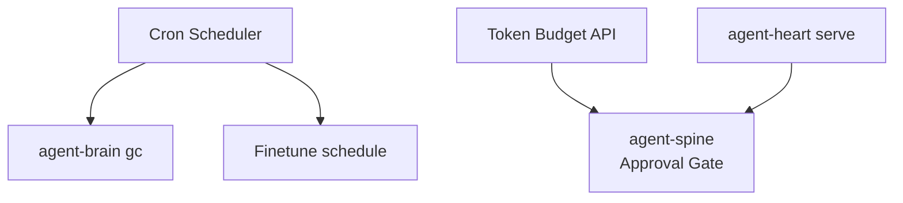

# agent-heart

**Background maintenance daemon — scheduled agent-brain GC, token budgeting, and spine budget gates.**

Part of the **[Autonomic AI](https://github.com/autonomic-ai-dev/agent-body)** ecosystem. Runs periodic `agent-brain gc`, exposes predictive token budgeting for agent-spine, and registers on the spine event bus. It does not duplicate brain logic; it orchestrates it on a schedule.

| Standalone | Integrated |
|------------|------------|
| `agent-heart gc` (one-shot) | Supervised by `autonomic start` on port **3101** |
| `agent-heart budget check` | agent-spine calls `POST /budget/check` before LLM nodes |
| Cron scheduler | `[heart]` in `~/.autonomic/config.toml` |

---

## Why agent-heart?

| Problem | agent-heart answer |
|---------|-------------------|
| Index bloat over weeks | **Scheduled GC** — cron-driven `agent-brain gc` without manual ops |
| Runaway token spend | **Budget gate** — spine checks `/budget/check` before delegating LLM work |
| No visibility into maintenance | **`status`** — last GC, finetune schedule, budget ceiling |
| Background work blocks IDE | **Daemon** — HTTP `:3101`, separate from MCP stdio |



---

## Quick Install

```bash
curl -fsSL https://raw.githubusercontent.com/autonomic-ai-dev/agent-heart/master/scripts/install.sh | bash
# or full stack:
curl -fsSL https://raw.githubusercontent.com/autonomic-ai-dev/agent-body/master/scripts/install-all-organs.sh | bash
```

Verify:

```bash
agent-heart version
agent-heart status
```

---

## Main features

| Feature | Setup | Why use it |
|---------|-------|------------|
| **Scheduled GC** | `serve` + `[heart.schedule]` | Keeps brain index healthy without manual cron |
| **Token budget gate** | `budget check` / HTTP API | Prevents spine from burning unbounded tokens |
| **Finetune schedule** | config cron | Triggers muscle train when enough trajectories exist |
| **One-shot GC** | `agent-heart gc` | CI or ad-hoc maintenance |
| **Health endpoint** | `:3101/health` | Supervisor and integration probes |

---

## Commands

| Command | Description |
|---------|-------------|
| `serve` | Daemon with cron GC and HTTP API |
| `gc` | Run one agent-brain GC pass |
| `status` | Schedule and last-run info |
| `budget check --tokens N` | Token budget gate (used by agent-spine) |
| `budget stats` | Budget usage and anomaly detection |

---

## HTTP API

| Endpoint | Description |
|----------|-------------|
| `GET /health` | Daemon health |
| `POST /budget/check` | Approve or deny token spend |

---

## Configuration

Section `[heart]` in `~/.autonomic/config.toml` · State under `~/.autonomic/state/heart/`

```toml
[heart.schedule]
enabled = true
cron = "0 3 * * *"

[heart.token_budget]
enabled = true
ceiling = 8000
```

---

## Local setup

```bash
git clone https://github.com/autonomic-ai-dev/agent-heart.git && cd agent-heart
cargo build --release -p agent-heart
./target/release/agent-heart status
# with full stack running:
autonomic start    # starts NATS, nerves, then heart
```

---

## Development

```bash
cargo test --release -p agent-heart
```

---

## License

MIT
