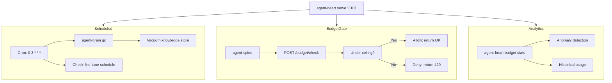

# agent-heart — Background Maintenance & Quota Controller

**Cloud-Native role: Controller manager / GC** — scheduled memory GC, token budget gates, and background maintenance for the agent stack.

`agent-heart` is the background controller for Autonomic. It runs periodic garbage collection cycles to keep the knowledge index healthy, exposes a token budget API that prevents agents from burning through LLM quotas, and tracks model fine-tuning schedules.

---

## Under the Hood: How it Works

Left to run indefinitely, an agent's memory index accumulates stale entries and embedding bloat. Furthermore, without a budget gate, a runaway agent can burn arbitrarily many tokens in an infinite retry loop.

`agent-heart` solves both by running as a lightweight background daemon:

1. **Preventive Maintenance (Cron)** 
It uses a native `tokio-cron` scheduler to trigger background maintenance. For example, at 3:00 AM every night, it triggers `agent-brain gc` to prune stale facts, deduplicate vector embeddings, and vacuum the local SQLite database, ensuring retrieval stays lightning fast.

2. **Cost Control (Token Budget API)** 
It exposes a strict `/budget/check` HTTP endpoint. Before `agent-spine` executes any LLM-heavy node, it queries `agent-heart`. If the requested token spend exceeds the daily ceiling or triggers an anomaly detection rule, `agent-heart` denies the request and safely halts the workflow before you incur massive API bills.



---

## Standalone vs Integrated

| Mode | What you type | What happens |
|------|--------------|--------------|
| **Standalone** | `agent-heart gc` | One-shot garbage collection pass |
| **Standalone** | `agent-heart budget check --tokens 5000` | Manual budget gate check |
| **Standalone** | `agent-heart serve` | Daemon with cron GC + HTTP API on `:3101` |
| **Integrated** | `autonomic start` | Supervised by agent-body; reads `[heart]` from unified config |
| **Integrated** | agent-spine budget gate | Spine calls `POST /budget/check` automatically before LLM nodes |
| **Integrated** | agent-heart → agent-brain | `gc` command triggers agent-brain's index maintenance |

In standalone mode, agent-heart is a CLI tool for one-shot GC and budget inspection. In integrated mode, it runs as a supervised daemon that agent-spine queries automatically, and agent-body ensures it starts after NATS and nerves.

---

## Why agent-heart?

| Problem | agent-heart answer |
|---------|-------------------|
| Index bloat degrades retrieval quality over weeks | **Scheduled GC** — cron-driven `agent-brain gc` without manual ops |
| Runaway token spend from unbounded agent runs | **Budget gate** — spine checks `/budget/check` before LLM-heavy nodes |
| No visibility into maintenance state | **`status`** — shows last GC, fine-tune schedule, budget ceiling |
| Background maintenance blocks the IDE | **HTTP daemon** — `:3101`, separate from MCP stdio, non-blocking |

---

## What you get

| Feature | Why use it |
|---------|------------|
| **Scheduled GC** | `serve` + `[heart.schedule]` — keeps brain index healthy without manual cron |
| **Token budget gate** | `POST /budget/check` — prevents spine from burning unbounded tokens |
| **Fine-tune schedule** | Configurable cron — triggers `muscle train` when enough trajectories exist |
| **One-shot GC** | `agent-heart gc` — for CI or ad-hoc maintenance |
| **Health endpoint** | `GET /health` — for supervisor probes and integration tests |
| **Anomaly detection** | Statistical outliers in token usage flagged automatically |

---

## Commands

| Command | Description |
|---------|-------------|
| `agent-heart serve` | Start daemon with cron GC, fine-tune scheduler, and HTTP API |
| `agent-heart gc` | Run one agent-brain GC pass immediately |
| `agent-heart status` | Show schedule, last GC, fine-tune state, budget ceiling |
| `agent-heart budget check --tokens N` | Check whether N tokens are within budget (used by spine) |
| `agent-heart budget stats` | Show historical usage, anomaly detection, and predictions |

Global `--progress` (or `AGENT_PROGRESS=1`) enables structured ProgressTree CLI output.

---

## HTTP API

| Method | Endpoint | Description |
|--------|----------|-------------|
| `GET` | `/health` | Daemon health and uptime |
| `POST` | `/budget/check` | Approve or deny a token spend request (body: `{"tokens": N}`) |

---

## Quick Install

```bash
curl -fsSL https://raw.githubusercontent.com/autonomic-ai-dev/agent-heart/master/scripts/install.sh | bash

# Or install the full stack:
curl -fsSL https://raw.githubusercontent.com/autonomic-ai-dev/agent-body/master/scripts/install-all-organs.sh | bash
```

Verify:
```bash
agent-heart version
agent-heart status
```

---

## Configuration

Section `[heart]` in `~/.autonomic/config.toml`. State under `~/.autonomic/state/heart/`.

```toml
[heart.schedule]
enabled = true
cron = "0 3 * * *"

[heart.token_budget]
enabled = true
ceiling = 8000
```

---

## Development

```bash
git clone https://github.com/autonomic-ai-dev/agent-heart.git && cd agent-heart
cargo build --release -p agent-heart
cargo test --release -p agent-heart
```

---

## License

MIT
